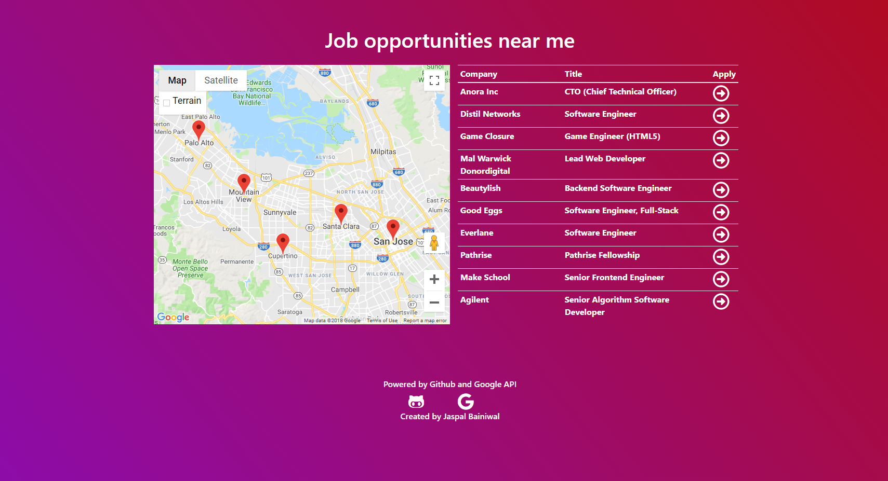

# Job helper project
This is a application I created to help me find job opportunities.
I built this Node js application with express, github api, and google maps api.
# Screentshot of application

## Packages used
* dotenv
* ejs
* express
* node-geocoder
* request

## What I learned
* How to make api requests from Node js
* Google maps api and using the api with node js
* Protecting sensitive information such as keys with dotenv package.
* Improved my javascript skills
* Interacting with javascript objects
* Improved frontend skills
